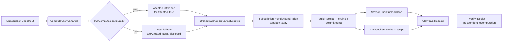

# Clawback

**A verifiable execution layer for AI agents that act on your behalf.**

AI agents are moving past generating text into taking consequential actions — requesting
refunds, cancelling subscriptions, filing claims, negotiating on your behalf. Once an agent
acts, almost nothing lets you prove afterward what it actually did, or detect if that record
was altered. Clawback answers that with a cryptographically linked execution lifecycle instead
of a UI that simply says "verified" and asks you to believe it.

```
CASE → PRIVATE ANALYSIS → PROPOSED ACTION → OWNER APPROVAL → EXECUTION → OUTCOME → RECEIPT
```

Each stage commits to the previous commitment plus its own evidence. Altering any earlier stage
invalidates every commitment computed after it. The result is independently recomputable by
anyone — not just trusted because Clawback's frontend renders a green badge.

The first concrete use case is subscription/billing-dispute recovery, the same failure mode
that got DoNotPay fined **$193,000 by the FTC in February 2025** for claiming its "AI lawyer"
had been tested to a standard it never met. The underlying primitive — an approval-gated,
cryptographically committed, independently verifiable agent action — generalizes past billing
disputes to any consequential action an AI agent takes for a user.

---

## Built, not mocked

Every claim below is backed by a real transaction hash or a real, reproducible test run — not
a diagram of what the architecture would do.

| Component | Evidence |
| --- | --- |
| 0G Compute | Real ledger funded, real inference request, provider `0xa48f0128…7E67836`, model `qwen/qwen2.5-omni-7b`, `broker.inference.processResponse() === true` |
| 0G Storage | Real upload transaction, real per-upload storage fee, real root hash, byte-identical round-trip on independent download |
| 0G Chain | `CaseAnchor.sol` deployed on **0G mainnet** (chain ID `16661`) at [`0x91b58e90B9FeCe02952865C1337d64f9ceeC1A25`](https://chainscan.0g.ai/address/0x91b58e90B9FeCe02952865C1337d64f9ceeC1A25); real `anchor()` writes, independent `verify()` reads, `AlreadyAnchored` correctly rejects a repeat |
| Full lifecycle | The real, unmodified `Orchestrator` (no mocks) driven end to end: Compute → Storage → mainnet anchor → receipt, independently re-verified in a separate process |
| Tamper detection | 7 hostile mutations (case field, approval commitment, approved message, execution artifact, outcome/savings, receipt status, receipt commitment) — every one flips `allCryptographicChecksPassed` to `false` |
| Authorization | Owner request → `200`; unauthenticated stranger on the same case → `403`, no case data in the response body |
| Tests | **74/74 passing**, `tsc -b` clean, production `next build` clean |

See [`LIMITATIONS.md`](./LIMITATIONS.md) §7 and §12 for exactly which of these are reproducible
without operator-held funded keys, and what degrades honestly when they're absent.

---

## Architecture

```
apps/web            Next.js app — case creation, approval, receipts UI, live /api/status
packages/shared      Domain types, case state machine, commitment/chain primitives
packages/privacy     At-rest encryption, log redaction, the data-flow registry
packages/providers   Outside-world seam — deterministic sandbox + a real-provider interface
packages/agent       CaseStore + Orchestrator — the only component allowed to move a case forward
packages/compute     0G Compute wrapper — real @0gfoundation/0g-compute-ts-sdk calls
packages/storage     0G Storage wrapper — real @0gfoundation/0g-storage-ts-sdk calls
packages/chain       CaseAnchor.sol + an ethers wrapper for on-chain anchoring/verification
packages/payments    Contingency-fee math and a settlement-ledger abstraction
packages/receipts    Receipt construction and an INDEPENDENT verifier
```

Nine packages, one responsibility each, each with its own test suite. `Orchestrator` is the
single choke point that can advance a case's state — every transition goes through
`packages/shared`'s state machine, so no caller can skip a step, not even by accident.



---

## 0G integration

0G is the evidence and anchoring layer underneath the receipt, not a logo on a slide:

- **0G Compute** — attests to the *execution mechanism*: `broker.inference.processResponse()`
  returns a TEE-signed verdict for the selected provider's response. It does not, and cannot,
  attest to what a merchant later did with that output.
- **0G Storage** — durable, content-addressed evidence artifacts. A receipt's root hash is
  independently downloadable and byte-comparable by anyone with the hash.
- **0G Chain** — `CaseAnchor.sol` gives the receipt's terminal commitment an immutable anchor
  *outside Clawback's own database*. `verify(caseId, commitment)` is a public, stateless read
  — no Clawback credentials, no trust in Clawback's API required.

**The trust boundary, stated precisely:** Clawback's commitment chain proves the integrity of
its own recorded lifecycle. 0G Chain proves that record wasn't quietly rewritten after the
fact. Neither proves a real merchant honored a request, and TEE attestation is not unique to
0G — AWS Nitro, Azure Confidential Computing, and Google Confidential Space all ship it too.
What 0G narrowly, concretely contributes is a settlement/anchoring layer not controlled by the
same company asking you to trust it.

```
@0gfoundation/0g-compute-ts-sdk@0.9.0
@0gfoundation/0g-storage-ts-sdk@1.2.11
```

Both adapters (`packages/compute/src/attestedClient.ts`, `packages/storage/src/storageClient.ts`)
were built against these SDKs' actual `.d.ts` signatures. Where the SDK doesn't expose a field
— a model hash, an enclave measurement — this codebase doesn't invent one.

All three integrations are **optional at runtime**. `loadComputeConfig` / `loadStorageConfig` /
`loadChainConfig` each return `null`, not throw, when unconfigured, and every downstream
consumer treats that as a normal, honestly-disclosed state — never as a live result.

### `CaseAnchor.sol` — an anchoring primitive, not a database

The contract is small on purpose. It never receives raw financial data and can't:

```solidity
function anchor(bytes32 caseId, bytes32 receiptCommitment, bytes32 previousCommitment) external;
function verify(bytes32 caseId, bytes32 expectedReceiptCommitment) external view returns (bool);
function getAnchor(bytes32 caseId) external view returns (Anchor memory);
```

`anchor()` reverts with `AlreadyAnchored` if the case was anchored before — a case's history is
written once. `verify()` is the function a skeptical third party calls directly against the
chain, with nothing but a public RPC endpoint and the commitment they want to check. No
constructor, no owner, no upgrade path — the minimum on-chain footprint the receipt model
actually needs.

---

## Receipt and verification model

A receipt isn't a report *about* a case — it's five chained SHA-256 commitments:

```
caseCommitment → actionCommitment → executionCommitment → outcomeCommitment → receiptCommitment
```

`packages/receipts/src/builder.ts` produces this chain; `packages/receipts/src/verifier.ts`'s
`verifyReceipt()` is a deliberately *independent* implementation that recomputes every
commitment from the raw case artifacts using nothing but the same pure `commit`/`chain`
functions — it never trusts the receipt object's own claims about itself. Forging a
`receiptCommitment` or flipping a `status` field after the fact is caught by a dedicated check
that recomputes the final link fresh; see [`VERIFICATION.md`](./VERIFICATION.md) for all nine
checks in full.

Every check carries one of five evidence-strength labels — never a blanket "verified":

| Label | Meaning |
| --- | --- |
| `cryptographically_verifiable` | A third party can recompute the hash and check it matches. |
| `tee_attested` | Backed by `processResponse()` — real, but trusts the TEE vendor's hardware root. |
| `economically_enforced` | Backed by funds actually moving, not self-proving alone. |
| `trusted_claim` | Believed, not provable (a counterparty's own confirmation). |
| `not_independently_verifiable` | Explicitly unsolved — most importantly, whether a human secretly did the work. |

The frontend's "How was this verified?" panel renders exactly this taxonomy — a trusted claim
never gets upgraded to look like cryptographic proof.

---

## Security

| Property | Result |
| --- | --- |
| Owner access to their own case | `200`, full case data |
| Unauthenticated access to another owner's case | `403`, `{"error":"Not authorized."}` — no case data |
| Receipt commitment forgery | Detected — `allCryptographicChecksPassed: false` |
| Status field forgery (stale commitment left in place) | Detected |
| Execution / outcome / approval artifact tampering | Detected |
| Sensitive fields at rest | AES-256-GCM encrypted (`packages/privacy`) |
| Sensitive fields in logs | Redacted via a field-by-field `DATA_FLOW_REGISTRY`, enforced by tests |
| Client-bundle secret scan | No private keys, no `ZG_*_PRIVATE_KEY` values found |
| Approval authorization | `Orchestrator.approveAndExecute` re-checks ownership and exact `proposalId` server-side — the client can't claim approval of anything it wasn't actually shown |
| Test suite | 74/74 passing |

Full write-up: [`THREAT-MODEL.md`](./THREAT-MODEL.md).

---

## Honest boundary

**What Clawback proves:** the recorded lifecycle is internally consistent and independently
recomputable; a configured Compute response passed 0G's own attestation check; a receipt
anchored on-chain wasn't altered afterward; unauthorized case access is rejected.

**What Clawback does not prove:** that a real merchant was contacted; that a real refund
occurred or money moved through a bank/card network; that no human operator secretly performed
the work outside the recorded pipeline (no system today can rule this out); that TEE
attestation is unique to 0G; that the platform operator can never see plaintext case data.

The only intentionally simulated boundary is the merchant/provider seam
(`packages/providers/src/sandboxProvider.ts`) — deterministic, never randomized, so a demo is
reproducible rather than a coin flip, and never disguised as live: every receipt it produces is
labeled `environment: "sandbox"`, enforced by `assertNoSandboxLeakage()`, which throws if that
label is ever wrong. `packages/providers/src/liveEmailProvider.ts` is the real-provider
extension point, intentionally unimplemented rather than faked.

Full document, deliberately the least flattering page in this repository:
[`LIMITATIONS.md`](./LIMITATIONS.md).

---

## Quick start

Requires Node 20+ and pnpm.

```bash
pnpm install
cp .env.example .env
node -e "console.log(require('crypto').randomBytes(32).toString('hex'))"   # paste into CLAWBACK_ENCRYPTION_KEY

pnpm test                          # 74 tests, no 0G credentials required
pnpm run build                     # tsc -b + full test suite + production Next.js build
pnpm --filter @clawback/web dev    # http://localhost:3000
```

0G Compute/Storage/Chain credentials are optional — see [`.env.example`](./.env.example). Without
them the app runs in honestly-disclosed unconfigured mode; `GET /api/status` reports each
integration's real runtime state (configured/unconfigured, mainnet/testnet when known), and the
landing page, "How privacy verification works," and every receipt page read from it live —
there is no hardcoded "LIVE" badge anywhere in the UI.

### Demo flow

1. `/cases/new` — describe a subscription problem. Nothing is sent yet.
2. Review the exact message Clawback proposes.
3. **Approve & Send** — the single most consequential action in the app; nothing executes
   without it.
4. See the (sandboxed, honestly labeled) outcome and receipt.
5. Open **How was this verified?** for the independently recomputed verification report.

---

## Links

- **Demo:** https://clawback-og.vercel.app/
- **GitHub:** https://github.com/embolaweb3/Clawback
- **Architecture:** [`ARCHITECTURE.md`](./ARCHITECTURE.md)
- **Verification model:** [`VERIFICATION.md`](./VERIFICATION.md)
- **Threat model:** [`THREAT-MODEL.md`](./THREAT-MODEL.md)
- **Limitations:** [`LIMITATIONS.md`](./LIMITATIONS.md)
- **Anchor contract (0G mainnet):** https://chainscan.0g.ai/address/0x91b58e90B9FeCe02952865C1337d64f9ceeC1A25
